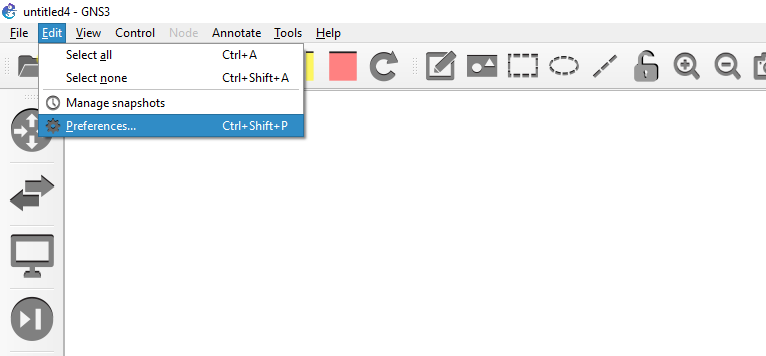
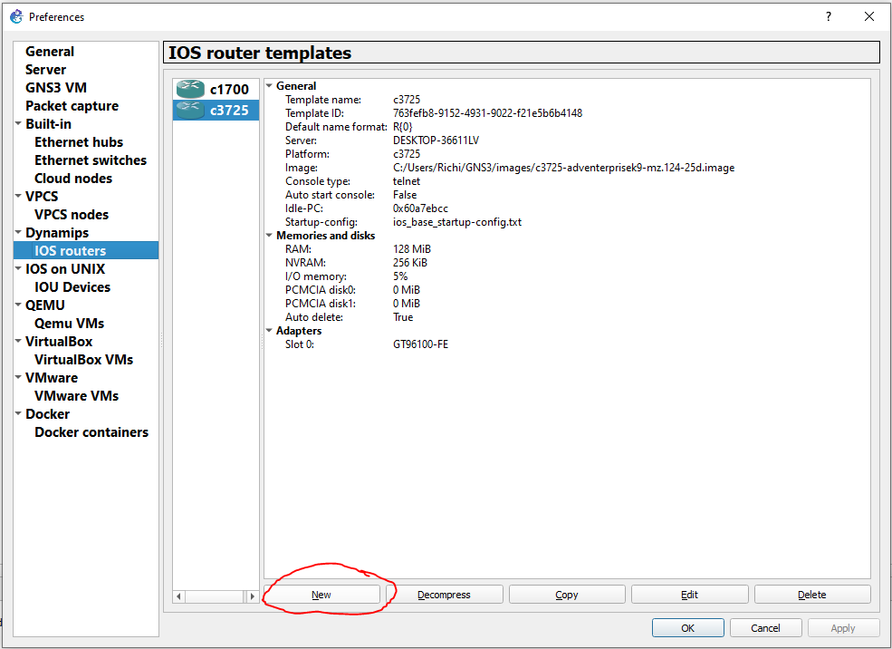
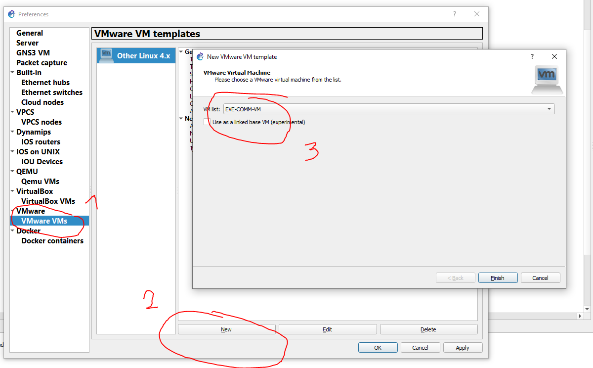
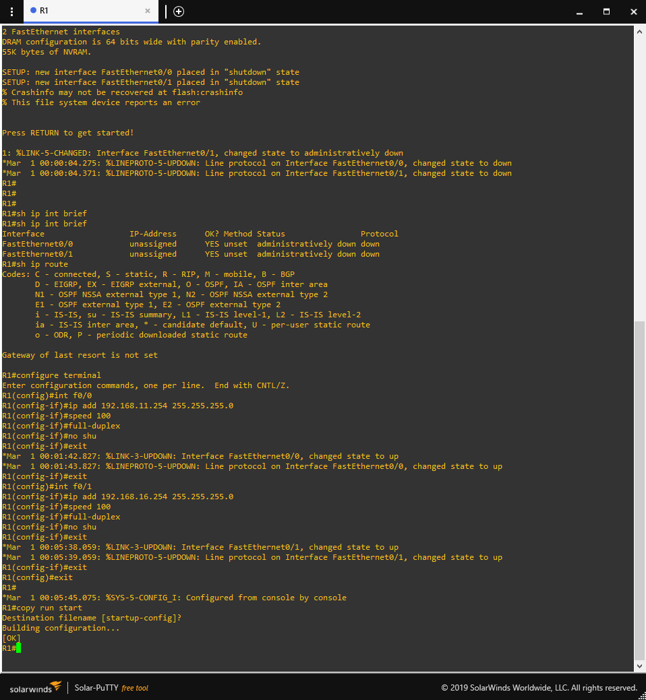
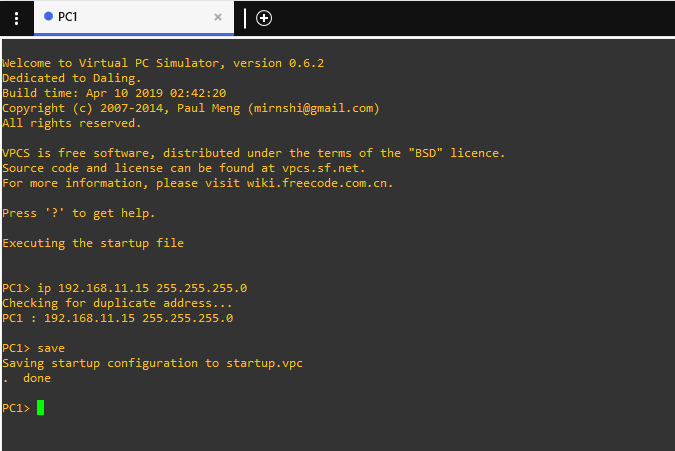

# Redes1-Practica1_201602916
## Ricardo Antonio Menéndez Tobías
## 201602916
***
## Componentes  
### Router
El router es un dispositivo encargado de enrutar o interconectar dispositivos en la red a la que este pertenece. Este establece una ruta que destinará a cada paquete de datos dentro de una red informática.  

 


Esto lo hace almacenando los paquetes recibidos y procesa el origen y destino de estos. Una vez procesados estos datos, se reenvia el paquete creando un encaminamiento con destino al anfitrión final. Este se encarga en decidir el siguiente salto en función de la tabla de encaminamiento, la cual es generado por algoritmos de Dijkstra.

#### Partes Físicas
    - Puertos de entrada
    - Entrada de conmutación
    - Puertos de salida
    - Procesador de encaminamiento
    
### Switch
Es un dispositivo digital lógico de interconexión de equipos que es de la parte de la capa de enlace de datos del modelo OSI. Este se encarga de interconectar dos o más hosts de manera similar a los puentes de red, pasando de un segmento a otro de acuerdo con la dirección MAC de destino de las tramas en la red y eliminando la conexión una vez terminada esta.  


### VPC
El termino VPC viene de Virtual Private Cloud, donde se refiere a un conjunto computacional configurable por demanda en una nube. En el caso de este ejercicio, es una "nube privada" creada con los recursos del ordenador. 

### Maquina Virtual
Es un software que simula un sistema de computación y puede ejecutar programas como si fuese una computadora real. En el caso de la práctica se utilizó Tiny Linux, una distribución de Linux que reduce el kernel del mismo a lo mas básico para poder usarse en dispositivos con recursos muy muy bajos.

***
## Topología

  

### Subredes
La topología esta compuesta por 2 subredes que estan conectadas entre sí por medio del router. Cada subred esta compuesta de un switch y 2 ordenadores.
#### Componentes
    - 1 Router C3725 con 2 interaces FastEthernet
    - 2 Ethernet Switch
    - 3 VPCs
    - 1 Maquina Virtual de Tiny Linux 

Ahora, el router conectara en su interfaz fe0/0 la subred 192.168.11.0/24 teniendo la IP 192.168.11.254 (siendo este el gateway para la respectiva subred). Esta interfaz va conectada a un puerto del Switch, el cual luego se comunicara con 2 VPCs teniendo las IPs 192.168.11.15 y 192.168.11.30 con un mascara de /24.

En la otra interfaz fe0/1, se realiza lo mismo, con la diferencia que su subred sera: 192.168.16.0/24 y la IP del router sera 192.168.16.254. El switch ira conectado a una VPC y a la maquina virtual de Tiny Linux, teniendo las IPs 192.168.16.15 y 192.168.16.30 respectivamente. quedando algo así:
##### Router
    - f0/0: 192.168.11.0/24 192.168.11.254
    - f0/1: 192.168.16.0 24 192.168.16.254

##### Switch 1
    - e0/0: 192.168.11.254 (Router)
    - e0/1: 192.167.11.15 (VPC)
    - e0/1: 192.167.11.30 (VPC)
##### Switch 2
    - e0/0: 192.168.16.254 (Router)
    - e0/1: 192.167.16.15 (VPC)
    - e0/1: 192.167.16.30 (VM-Tiny Linux)
***
## Configuración de Componentes
### Router
Muestra la sección de interfaces:  
 ```sh ip interface brief```  
 Muestra la configuración de rutas:    
 ```sh ip route```    
 entra al modo de configuración:  
 ```configure terminal```  
 entra a la interfaz Fastethernet seleccionada para su configuración:  
 ```int f0/(0/1)```  
 *Se define la IP de la interfaz y su mascara de subred:  
 ```ip add 192.168.(11/16).254 255.255.255.0```  
 Establecer velocidad de transferencia:  
 ```speed 100```  
 Establecer tipo de transmisión:  
 ```full-duplex```  
 Se prende la maquina:  
 ```no shu```  
 Salida de la edición de la interfaz:  
 ```exit```  
 Salida de la edición del modo de configuración (o si se desea configurar otra interfaz regresar al comando *):  
 ```exit```  
 Copiar la configuración y ejecutarla en arranque:  
 ```copy run start```  
### VPC
Setear la IP y mascara de la maquina  
``` ip 192.168.(11/16).(15/30) 255.255.255.0 ```  
Guarda la configuración  
``` save ```  
### VM TinyLinux

***
## Anexos
### Agregar Router y Maquina Virtual
Acceder al menu de configuración  
 
Agregar al router dandole todo a next    
   
Agregar la maquina virtual  
   

### Configurar Router
Se prende el router, y le damos doble click para acceder a la consola del router via SolarPutty.   
 

### Configurar VPC
Se prende la maquina, y le damos doble click para acceder a la consola del router via SolarPutty.   
 